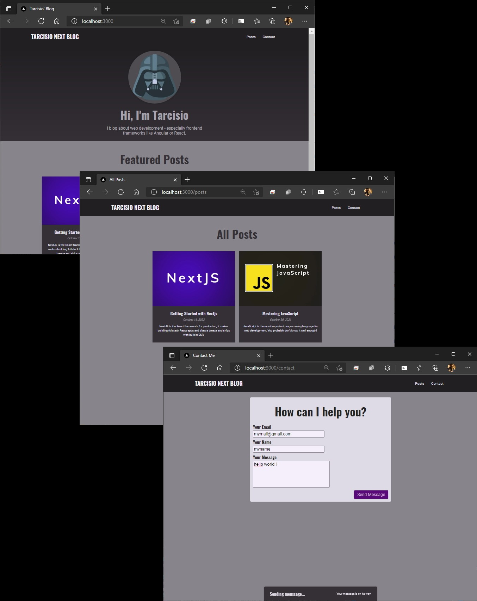

# Full Blog Example

  
**_Learned_**  
> _How to create a Hero Page_
_How to create a Navigation Bar_
_Use Link Nextjs component_
_Use props_
_How to use React-Markdown_
_Read & Fetch Data From Markdown Files_
_Use getStaticProps and getStaticPaths_
_Use Next.js Image component_
_Render Code Snippets from Markdown_
_Use React-Syntax-Highlighter_
_How to add a API Route_
_Use useState and useEffect_
_How to use mongoDB_
_How to add "head" Data_
_The slug page conscept_
_Use React Portals_

* According Maximilian Schwarzmüller class at Udemy